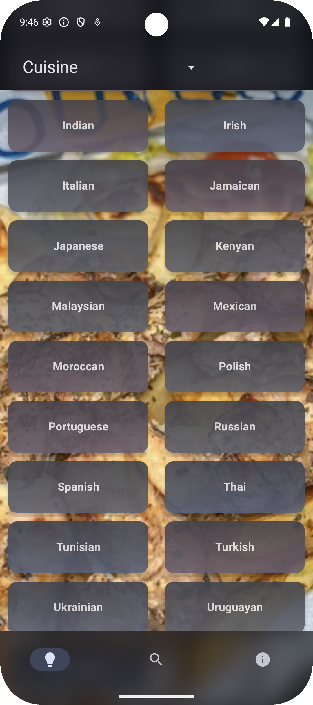

# Recipe Reference App

### WHAT IS THIS?
Keeping up with the latest Android trends is always a challenge. One of the techniques I use is to always have a reference app handy. These apps should showcase the latest Android architecture and patterns for the following areas:
- UI and Biz Logic Separation
- Navigation UX and Theme
- Data and Image Retrieval
- Threading
- Dependency Injection
- Testing

The latest incarnation for my reference app is called ***Recipes***. 

Since I love a good double entendre, this app ***conflates*** _Meal_ and _Code_ **Recipes**, creating a UX to demonstrate the techniques it describes. 

One data source for this app is from the excellent (and free) [TheMealDB](https://www.themealdb.com/) which has nice amount of categorized data with textual and visual information describing a semi-complex process (aka, a ***Meal Recipe***). The other data source was my 🧠 and describes the code used to build the app in the form of ***Code Recipes*** (sprinkled in amongst the ***Meal Recipes***).

The goal was to brush up on the the latest **Android** tech stack components and pack as many features as I could into an app created in 3 weekends of watching sports on the couch. **Junie** and **Claude** actually did a lot of work, and once again came through in frontend design and impl, dependency management, and kicking off new features. This time the data model was a huge AI win as I prompted **Junie** with the [TheMealDB API](https://www.themealdb.com/api.php) url, a reference to [Ktor](https://ktor.io/), and in less than 5 minutes the API layer materialized in my _git status_ staged log. 

Another reason this app came together so nicely is due to the plethora of free and easy to use **Android Tools and Libraries** supplied by both _Big-Biz_ (hello _GOOGLE_ and _JETBRAINS_), and the **Android Community ICs** toiling away on GitHub and Medium. The ***Code Recipes*** mostly come from these sources and describe the wiring and plumbing used to create a visually complelling **Android Application**.

### Screenshots

#### Meal Recipes
|                                      Categories                                      |                                       Cuisine                                       |                                        Detail List                                         |                                        Detail Step By Step                                         |
|:------------------------------------------------------------------------------------:|:-----------------------------------------------------------------------------------:|:------------------------------------------------------------------------------------------:|:--------------------------------------------------------------------------------------------------:|
|    |  |    |    |
|  |  |  |  |

#### Code Recipes
|                                    Code Recipes                                    |                                        Code Recipe Detail                                        |
|:----------------------------------------------------------------------------------:|:------------------------------------------------------------------------------------------------:|
|  |   |
|      |  |

https://github.com/user-attachments/assets/5ec15acd-8fb9-4403-a5a7-9258a0ab6ac7

### Code Recipes

This section was created by **Junie** using this prompt:
> Can you create a section in the README.md file that contains the code recipe info from CodeRecipes.kt. The Recipes should be categorized in sections by CodeRecipe.Area, contain the color theming from the code recipe area, and the title, description, and code section for each code recipe. Also collapsible in an initially collapsed state

<details>
<summary><strong>🏗️ Architecture</strong> (4 recipes)</summary>

### Separation of Concerns

**Description:**
- Encapsulate feature functionality into Modules
- Each Module contains separate classes for Biz Logic and UI
   - Use ViewModels for BizLogic
   - Use Compose Screens for UI
- Hoist State from ***ViewModel*** to UI to render the UX
- Send user action back to ***ViewModel*** to generate new state 
- **Separation of Concerns** facilitates **Single Responsibility** principle

**Code:**
```
**App File Structure**
app/src/main/java/org/balch/recipes/
├── MainActivity.kt                 # Entry point with navigation
├── RecipesApplication.kt           # App-level configuration
├── NavRoutes.kt                    # Route definitions
│
├── features/                       # 🎯 FEATURE MODULES
│   ├── ideas/                      # Ideas feature (Single Responsibility)
│   │   ├── IdeasScreen.kt          # ✨ UI Layer - Compose Screen
│   │   └── IdeasViewModel.kt       # 🧠 Business Logic Layer
│   ├── search/                     # Search feature (Single Responsibility)  
│   │   ├── SearchScreen.kt         # ✨ UI Layer - Compose Screen
│   │   └── SearchViewModel.kt      # 🧠 Business Logic Layer
│   └── details/                    # Details feature (Single Responsibility)
│       ├── DetailScreen.kt         # ✨ UI Layer - Compose Screen
│       └── DetailsViewModel.kt     # 🧠 Business Logic Layer
│
├── core/                           # 🔧 SHARED BUSINESS LOGIC
│   ├── models/                     # Data models used across features
│   │   ├── Meal.kt                 
│   │   ├── Category.kt             
│   │   └── CodeRecipe.kt           
│   ├── network/                    # API communication layer
│   │   ├── ApiService.kt           
│   │   ├── HttpClientFactory.kt           
│   │   └── TheMealDbApi.kt         
│   ├── repository/                 # Data access abstraction
│   │   ├── RecipeRepository.kt     
│   │   └── RepositoryModule.kt     
│   └── coroutines/                 # Async utilities
│       └── DispatcherProvider.kt   
│
└── ui/                             # 🎨 SHARED UI COMPONENTS
    ├── theme/                      # Material 3 theming
    │   ├── Theme.kt                
    │   ├── Color.kt                
    │   └── ThemePreview.kt         
    ├── widgets/                    # Reusable UI components
    │   ├── FoodLoadingIndicator.kt
    │   └── WebViewScreen.kt        
    └── nav/                        # Navigation utilities
        └── BackstackManager.kt     
        
🎯 Each FEATURE has dedicated ViewModel + Screen (Single Responsibility)
🔧 CORE contains shared business logic and data access
🎨 UI contains shared visual components and theming
```

### Repository with ApiService

**Description:**
- Use **Ktor** for Networking
- Create injectable `HttpClientFactory` to configure HTTP connections
- `ApiService` provides call patterns for HTTP requests
- Use `ApiService` to create specific services to remote apis
- Wrap the Specific ApiSerivce in  a Repository pattern to map raw API responses to domain objects

**Code:**
```
@Singleton
class ApiService @Inject constructor(
    private val httpClientFactory: HttpClientFactory,
    val dispatcherProvider: DispatcherProvider,
) {
    val client: HttpClient by lazy { httpClientFactory.create() }

    suspend inline fun <reified T> get(
        url: String,
        parameters: Map<String, String> = emptyMap()
    ): Result<T> =
        // ...

    fun close() {
        client.close()
    }
}

@Singleton
class TheMealDbApi @Inject constructor(
    private val apiService: ApiService
) {
    companion object {
        private const val BASE_URL = 'https://www.themealdb.com/api/json/v1/1'
        private const val CATEGORIES = "BASE_URL/categories.php"
        private const val MEAL_BY_ID = "BASE_URL/lookup.php"
    }
    
    suspend fun getCategories(): Result<CategoriesResponse> {
        return apiService.get(CATEGORIES)
    }
    
    suspend fun getMealById(id: String): Result<MealResponse> {
        return apiService.get(
            url = MEAL_BY_ID,
            parameters = mapOf("i" to id)
        )
    }
}

@Singleton
class RecipeRepositoryImpl @Inject constructor(
    private val api: TheMealDbApi
) : RecipeRepository {
    override suspend fun getCategories(): Result<List<Category>> {
        return api.getCategories().map { response ->
            response.categories
        }
    }
    override suspend fun getMealById(id: String): Result<Meal> {
        return try {
            api.getMealById(id).map { response ->
                response.meals.firstOrNull()
                    ?: throw IllegalArgumentException("Meal not found")
            }
        } catch (e: Exception) {
            Result.failure(e)
        }
    }
}
```

### Hilt ViewModel Factory

**Description:**
- Use `HiltViewModel` and `assistedFactory` to create unique ***ViewModel*** per ***Screen*** to push on the ***backstack***.
- Define Factory using `@AssistedFactory` annotation
- Use Factory to create ViewModels to pass to Screens via `hiltViewModel`

**Code:**
```
// ViewModel Definition
@HiltViewModel(assistedFactory = DetailsViewModel.Factory::class)
class DetailsViewModel @AssistedInject constructor(
    @Assisted val detailType: DetailType,
    private val repository: RecipeRepository,
    dispatcherProvider: DispatcherProvider
) : ViewModel() {

// ViewModel Factory
@AssistedFactory
interface Factory {
    fun create(detailType: DetailType): DetailsViewModel
}

// Create ViewModel
val viewModel =
    hiltViewModel<DetailsViewModel, DetailsViewModel.Factory>(
        creationCallback = { factory ->
            factory.create(detailRoute.detailType)
        }
    )
```

### Random Exhaustive List 

**Description:**
- Sometimes you need to randomly show items from a list 
- Using a random index is easy, but leads to many repeated items
- Its better to show all the items in a random list to enure freshness  
    - Save shuffled main list to randomize order
    - Return and remove items from front of saved list 
    - Add more shuffled items when capacity runs low

**Code:**
```
private val randomRecipes by lazy {
    mutableListOf(*recipes.shuffled().toTypedArray())
}
fun getRandomRecipes(count: Int): List<CodeRecipe> {
    if (count <= 0) { return emptyList() }

    if (randomRecipes.size < count) {
        randomRecipes.addAll(recipes.shuffled())
    }

    val result = mutableListOf<CodeRecipe>()
    repeat(count) {
        result.add(randomRecipes.removeFirst())
    }
    return result
}
```

</details>

<details>
<summary><strong>🎨 Theme</strong> (4 recipes)</summary>

### ColorScheme

**Description:**
- Use `isSystemInDarkTheme` and `dynamicColor` to control color scheme

**Code:**
```
val colorScheme = when {
    dynamicColor && Build.VERSION.SDK_INT >= Build.VERSION_CODES.S -> {
        val context = LocalContext.current
        if (darkTheme) dynamicDarkColorScheme(context) else dynamicLightColorScheme(context)
    }
    darkTheme -> DarkColorScheme
    else -> LightColorScheme
}
```

### ThemePreview

**Description:**
- Create annotation with an `@Preview` for each theme
- Use `@ThemePreview` on Screens and Widgets

**Code:**
```
@Preview(
    uiMode = Configuration.UI_MODE_NIGHT_YES,
    group = "Theme",
    name = "ThemeDark",
)
@Preview(
    uiMode = Configuration.UI_MODE_NIGHT_NO,
    group = "Theme",
    name = "ThemeLight",
)
annotation class ThemePreview
```

### Markdown Render🎨💰

**Description:**
- Simple Markdown Composable that renders beautiful code in Android (and other platforms)
- Support Light/Dark Theme and Code Markdown syntax
- Thank you **Mike Penz**!!

**Code:**
```
@Composable
fun MarkdownCodeSnippet(
    codeSnippet: String,
    color: Color,
    modifier: Modifier = Modifier
) {
    val isDarkTheme = isSystemInDarkTheme()
    val highlightsBuilder = remember(isDarkTheme) {
        Highlights.Builder()
            .theme(SyntaxThemes.atom(darkMode = isDarkTheme))
            .language(SyntaxLanguage.KOTLIN)
    }
    Markdown(
        modifier = modifier.padding(16.dp),
        content = codeSnippet,
        components = markdownComponents(
            codeBlock = {
                MarkdownHighlightedCodeBlock(
                    content = it.content,
                    node = it.node,
                    highlightsBuilder = highlightsBuilder,
                    showHeader = true, 
                )
            },
            codeFence = {
                MarkdownHighlightedCodeFence(
                    content = it.content,
                    node = it.node,
                    highlightsBuilder = highlightsBuilder,
                    showHeader = true,
                )
            },
        )
    )
}
```

### Glass Blur with Haze

**Description:**
- Use **Haze** to create iOS-like glassmorphism blur 
- Save the `hazeState` via `rememberHazeState`
- Make the `NavDisplay` contents the source to blur by calling `hazeSource()`
- Apply blur effect to `NavigationBar` by calling `hazeEffect()`
   - For progressive blur use `HazeProgressive.verticalGradient`
- Each ***Screen*** manages its own blur effect for the `TopAppBar`
- Thank you **Chris Banes**!!

**Code:**
```
@Composable
private fun MainContent() {
    val hazeState = rememberHazeState()

    RecipesTheme {
        Scaffold(
            bottomBar = {
                NavigationBar(
                    containerColor = Color.Transparent,
                    contentColor = MaterialTheme.colorScheme.onSurface,
                    modifier = Modifier
                        .hazeEffect(state = hazeState, style = LocalHazeStyle.current) {
                            HazeProgressive.verticalGradient(
                                startIntensity = 1f,
                                endIntensity = 0f,
                            )
                        },
                    ) {
                    // ...
                    }
                }
            }
        ) { innerPadding ->
            NavDisplay(
                modifier = Modifier.hazeSource(state = hazeState),
                entryProvider = entryProvider {
                    entry<Ideas> {
                        IdeasScreen(
                        // ...
                        )
                    }
                    entry<SearchRoute> { searchRoute ->
                        // ...
                    }
                    entry<Search> {
                        // ...
                    }
                    entry<DetailRoute> { detailRoute ->
                        // ...
                    }
                    entry<Info> { InfoScreen() }
                },
            )
        }
    }
}                
```

</details>

<details>
<summary><strong>🧭 Navigation</strong> (6 recipes)</summary>

### Bottom Nav

**Description:**
- Wrap `NavigationBar` in `Scaffold` 
- Use `AnimatedVisibility` to control visibility of `NavigationBar`
- `TopLevelRoute` represent displayable items in `NavigationBarItem`
- Manage ***backstack*** in the `NavigationBar`
   - Pop the current ***Screen*** off the ***backstack*** if it not the root
   - Push the new route onto the ***backstack***

**Code:**
```
Scaffold(
    bottomBar = {
        AnimatedVisibility(
            visible = showNavigationBar && backstackManager.peek() is TopLevelRoute,
            enter = slideInVertically { it },
            exit = slideOutVertically { it },
        ) {
            NavigationBar(
                containerColor = Color.Transparent,
                contentColor = MaterialTheme.colorScheme.onSurface,
            ) {
                TOP_LEVEL_ROUTES.forEach { topLevelRoute ->
                    val isSelected = topLevelRoute == backstackManager.peek()
                    NavigationBarItem(
                        selected = isSelected,
                        onClick = {
                            // pop the current screen off the backstack if it not the root
                            if (backstackManager.peek() != TOP_LEVEL_ROUTES[0]) {
                                backstackManager.pop()
                            }
                            // push the new route onto the backstack
                            if (backstackManager.peek() != topLevelRoute) {
                                backstackManager.push(topLevelRoute)
                            }
                        },
                        icon = {
                            Icon(
                                imageVector = topLevelRoute.icon,
                                contentDescription = topLevelRoute.contentDescription
                            )
                        }
                    )
                }
            }
        }
    }
```

### Nav3 EntryDecorators

**Description:**
- Define **Nav3** `entryDecorators` to provide state management and to facilitate ***ViewModel*** creation.

**Code:**
```
    // In order to add the `ViewModelStoreNavEntryDecorator`
    // we also need to add the default `NavEntryDecorator`s as well. These provide
    // extra information to the entry's content to enable it to display correctly
    // and save its state.
    entryDecorators = listOf(
        rememberSceneSetupNavEntryDecorator(),
        rememberSavedStateNavEntryDecorator(),
        rememberViewModelStoreNavEntryDecorator()
    ),
```

### Nav3 EntryProvider DSL Syntax

**Description:**
- Use **Nav3** `entryProvider` DSL syntax for simple App Nav
- Provides a convenient way to create ***ViewModels*** and ***Screens*** on the ***backstack***

**Code:**
```
    entryProvider = entryProvider {
        entry<Ideas> {
            IdeasScreen(
                // ...
            )
        }
        entry<SearchRoute> { searchRoute ->
            // ...
        }
        entry<Search> {
            // ...
        }
        entry<DetailRoute> { detailRoute ->
            // ...
        }
        entry<Info> { InfoScreen() }
    }
```

### Nav3 Backstack Management

**Description:**
- In **Nav3**, you own the ***backstack***.
- Store ***backstack*** in `SnapshotStateList<NavKey>` 
- Push/Pop works for simple applications

**Code:**
```
@ActivityRetainedScoped
class BackstackManager @Inject constructor() {
    private val _backstack : SnapshotStateList<NavKey> = mutableStateListOf(Ideas)

    val backstack: List<NavKey>
        get() = _backstack.toList()

    fun push(destination: NavKey){
        _backstack.add(destination)
    }

    fun pop(){
        _backstack.removeLastOrNull()
    }

    fun peek(): NavKey? =
        _backstack.lastOrNull()
}
```

### BackHandler in Screens

**Description:**
- Conditionally enable `BackHandler` 
- Use to return to initial ***Screen*** state before exiting app/screen

**Code:**
```
@Composable
fun IdeasScreen(
    modifier: Modifier = Modifier,
    viewModel: IdeasViewModel
) {
    // Return to categories if this is not a top level tob
    BackHandler(enabled = !uiState.isTopLevelState) {
        viewModel.changeBrowsableType(BrowsableType.Category)
    }

    IdeasLayout(
        uiState = uiState,
        onBrowsableTypeChange = viewModel::changeBrowsableType,
        modifier = modifier
    )
}          
```

### Bottom Nav AutoHide

**Description:**
- Calculate `showNavigationBar` from `firstVisibleIndex` and scroll direction
- Use `showNavigationBar` in `AnimatedVisibility` to control visibility of `NavigationBar`
- Delegate scroll handling to each ***Screen*** via `onScrollChange`
   - Set `firstVisibleIndex` in handler to emit new `showNavigationBar` state

**Code:**
```
@Composable
private fun MainContent() {
    var previousVisibleIndex by remember { mutableIntStateOf(0) }
    var firstVisibleIndex by remember { mutableIntStateOf(0) }
    var showNavigationBar by remember { mutableStateOf(true) }
    LaunchedEffect(firstVisibleIndex) {
        showNavigationBar = firstVisibleIndex == 0 || firstVisibleIndex < previousVisibleIndex
        previousVisibleIndex = firstVisibleIndex
    }

    RecipesTheme {
        Scaffold(
            bottomBar = {
                AnimatedVisibility(
                    visible = showNavigationBar && backstackManager.peek() is TopLevelRoute,
                    enter = slideInVertically { it },
                    exit = slideOutVertically { it },
                ) {
                    NavigationBar(
                        // ...
                    )
                }
            }
        ) { innerPadding ->
            NavDisplay(
                entryProvider = entryProvider {
                    entry<Ideas> {
                        IdeasScreen(
                            onScrollChange = { firstVisibleIndex = it }
                            // ...
                        )
                    }
                    entry<SearchRoute> { searchRoute ->
                        SearchScreen(
                            onScrollChange = { firstVisibleIndex = it },
                            // ...
                        )
                    }
                    entry<Search> {
                        SearchScreen(
                            onScrollChange = { firstVisibleIndex = it },
                            // ...
                        )
                    }
                    // ...
                },
            )
        }
    }
}
```

</details>

<details>
<summary><strong>🧪 Testing</strong> (3 recipes)</summary>

### TestDispatcher on MainThread

**Description:**
- `DispatcherProvider` injected into ViewModels to control StateFlows
- `TestDispatcherProvider` implements `DispatcherProvider` for testing
- `MainCoroutineExtension` assigns provided `TestDispatcher` to `Dispatchers.Main`

**Code:**

**Declare Junit 5 Extension**   
```
class MainCoroutineExtension(
    val testDispatcher: TestDispatcher = UnconfinedTestDispatcher()
) : BeforeEachCallback, AfterEachCallback {               
    override fun beforeEach(context: ExtensionContext?) {
        Dispatchers.setMain(testDispatcher)
    }                
    override fun afterEach(context: ExtensionContext?) {
        Dispatchers.resetMain()
    }
}
```

**Use Extension in Test Class**   
```
class DetailsViewModelTest {

    private val dispatcherProvider: TestDispatcherProvider = TestDispatcherProvider()

    @JvmField
    @RegisterExtension
    val mainCoroutineExtension = MainCoroutineExtension(dispatcherProvider.testDispatcher)

    private val repository = mock<RecipeRepository>()
    
    // ...
}
```

### Turbine For StateFlow Testing

**Description:**
- Use `Turbine` for ***ViewModel*** stateFlow testing
- Ensures all emissions are accounted for
- May need to use `StandTestDispatcher` for Conflation issues when the ***ViewModel*** emits initial state too quickly.

**Code:**
```
@Test
fun `clearSearch emits Welcome state`() = runTest {
    val searchType = SearchType.Search("pasta")
    whenBlocking { repository.searchMeals("pasta") } doReturn(Result.success(testMeals))
    val viewModel = getViewModel(searchType)

    viewModel.uiState.test {
        awaitItem().assertValidShowState(searchType)
        awaitItem().assertValidShowState(
            searchType = searchType,
            meals = testMeals,
            isFetching = false
        )

        viewModel.clearSearch()
        awaitItem().assertWelcomeState()
    }
}
```

### Test Assertion Extensions

**Description:**
- Create extension functions for custom assertions to improve test readability and reusability

**Code:**
```
private fun UiState.assertValidShowState(meal: Meal) {
    assertThat(this).isInstanceOf(UiState.ShowMeal::class.java)
    val state = this as UiState.ShowMeal
    assertThat(state.meal).isEqualTo(meal)
}

private fun UiState.assertErrorState(message: String) {
    assertThat(this).isInstanceOf(UiState.Error::class.java)
    val state = this as UiState.Error
    assertThat(state.message).isEqualTo(message)
}
```

</details>

### Dependencies
| Dependency                                                                                     | Description                                         | 
|------------------------------------------------------------------------------------------------|-----------------------------------------------------|
| [Coil](https://coil-kt.github.io/coil/)                                                        | Image Loader for Jetpack Compose                    |  
| [Compose Material3](https://developer.android.com/jetpack/androidx/releases/compose-material3) | Material Design Components for Jetpack Compose      | 
| [Compose Navigation3](https://github.com/android/nav3-recipes)                                 | Navigation Component for Jetpack Compose            | 
| [Haze](https://chrisbanes.github.io/haze/latest/)                                              | Chris Banes 'glassmorphism' blur library for Compose. |
| [Hilt](https://developer.android.com/training/dependency-injection/hilt-android)               | Dependency Injection for Android                    | 
| [KmLogging](https://github.com/LighthouseGames/KmLogging)                                      | Kotlin Multiplatform logging library (v2.0.3).      |
| [Ktor](https://ktor.io/)                                                                       | HTTP Client for Android                             | 
| [Markdown Renderer](https://github.com/mikepenz/multiplatform-markdown-renderer)              | Mike Penz Multiplatform Markdown Renderer           |
| [TheMealDB](https://www.themealdb.com/api.php)                                                 | Free, easy to use, API for Food Recipes             |
| [Truth](https://truth.dev/)                                                                    | Google Assertion Library used for Testing           |
| [Turbine](https://github.com/cashapp/turbine)                                                  | Couroutine Flow Testing Library from CashApp        |
