# Recipe Reference App

### WHAT IS THIS?
Keeping up with the latest Android trends is always a challenge. One of the techniques I use is to always have a reference app handy. These apps should showcase the latest Android architecture and patterns for the following areas:
- UI and Biz Logic Separation
- Navigation UX and Theme
- Data and Image Retrieval
- Threading
- Dependency Injection
- Testing

The latest incarnation for my reference app is called Recipes. 

### Screenshots

#### Meal Recipes
|                                      Categories                                      |                                       Cuisine                                       |                                        Detail List                                         |                                        Detail Step By Step                                         |
|:------------------------------------------------------------------------------------:|:-----------------------------------------------------------------------------------:|:------------------------------------------------------------------------------------------:|:--------------------------------------------------------------------------------------------------:|
|  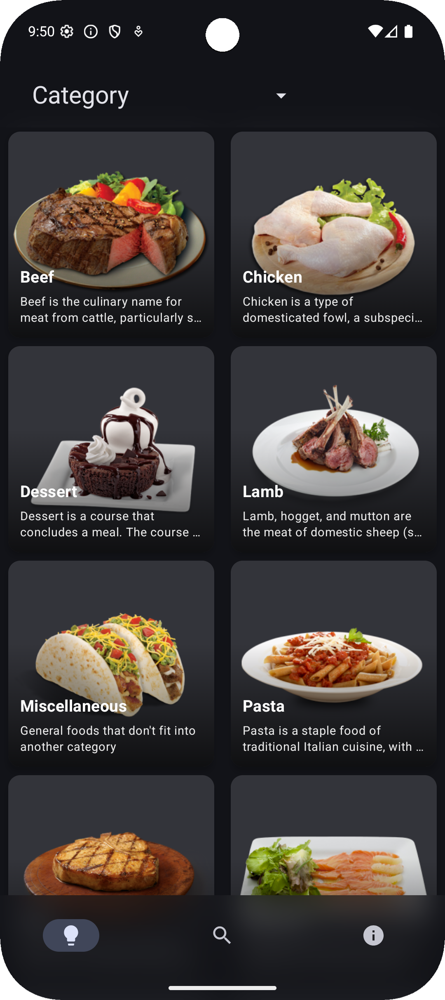  | 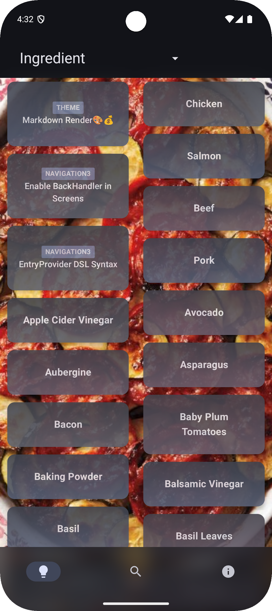 |  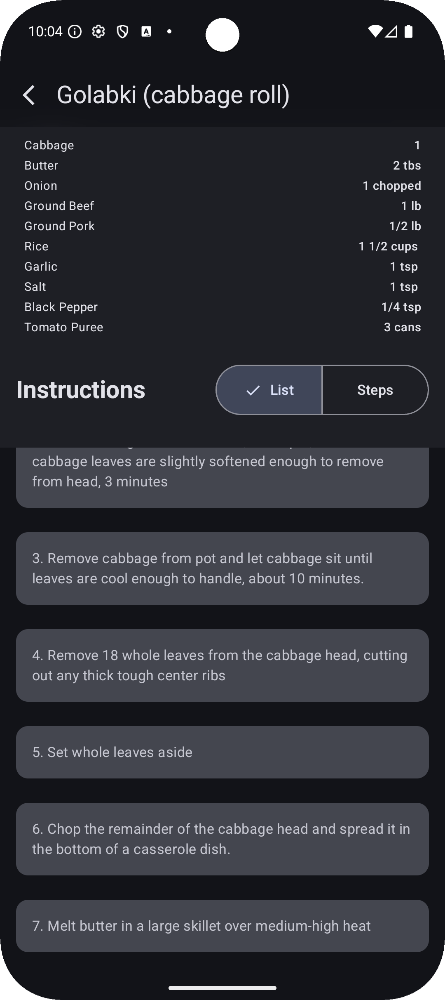  |  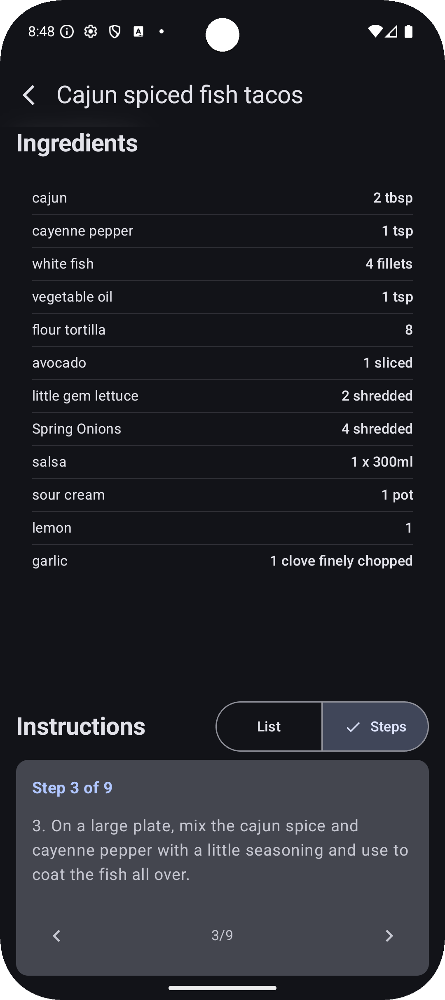  |
| 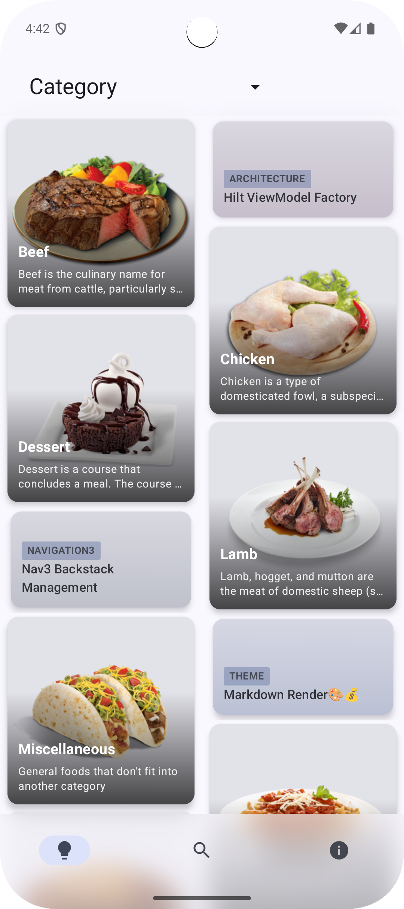 | 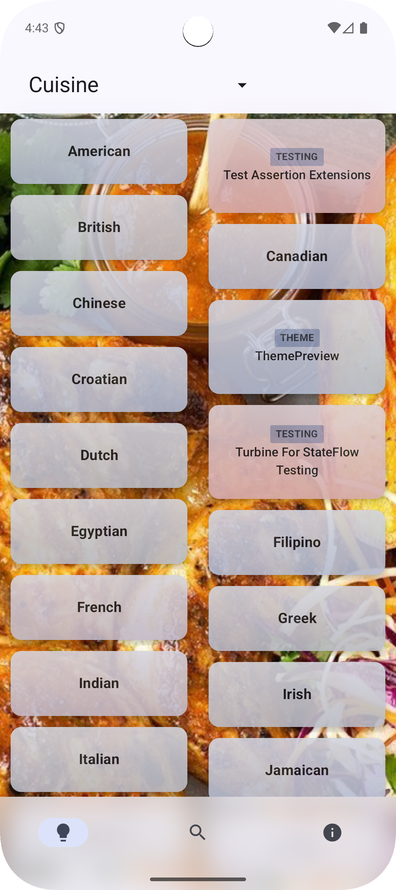 | 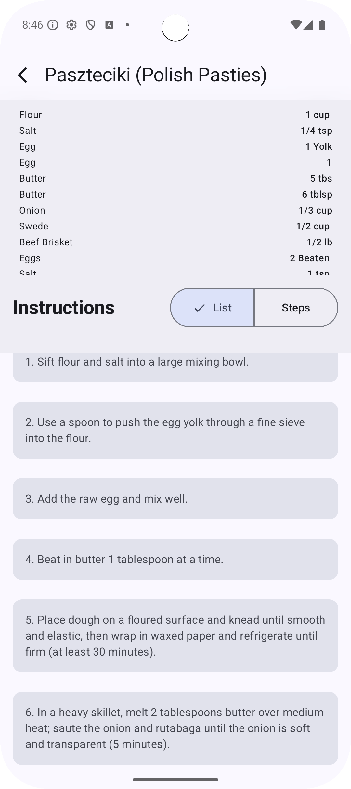 | 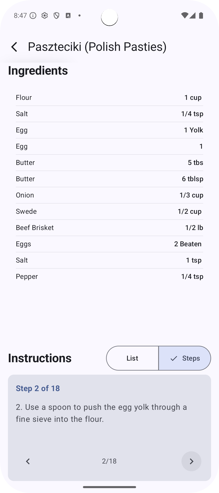 |

#### Code Recipes
|                                    Code Recipes                                    |                                        Code Recipe Detail                                         |
|:----------------------------------------------------------------------------------:|:-------------------------------------------------------------------------------------------------:|
| 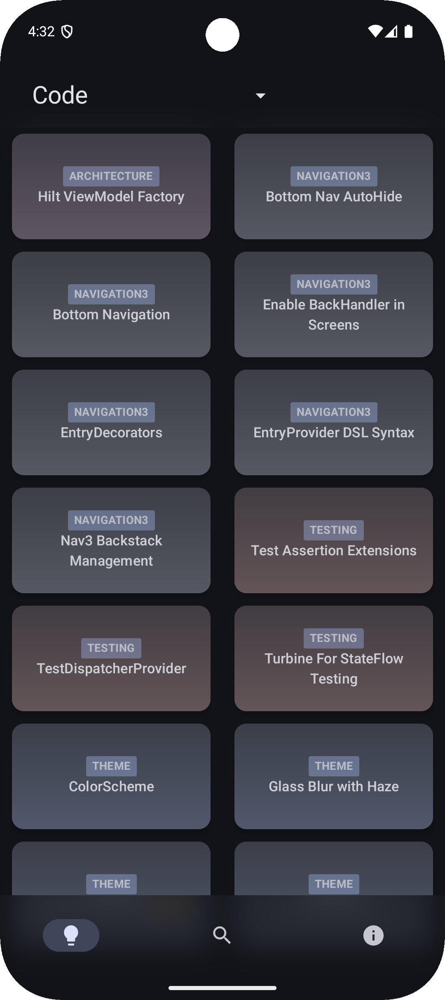 |  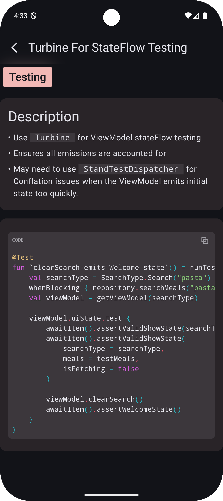  |
|  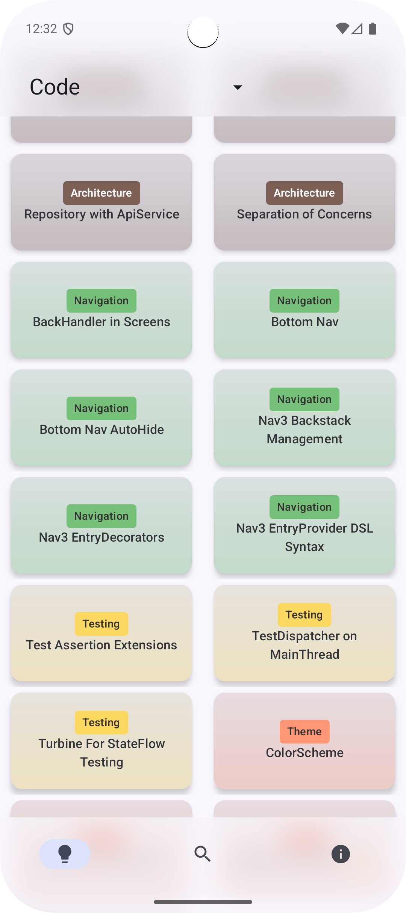   | 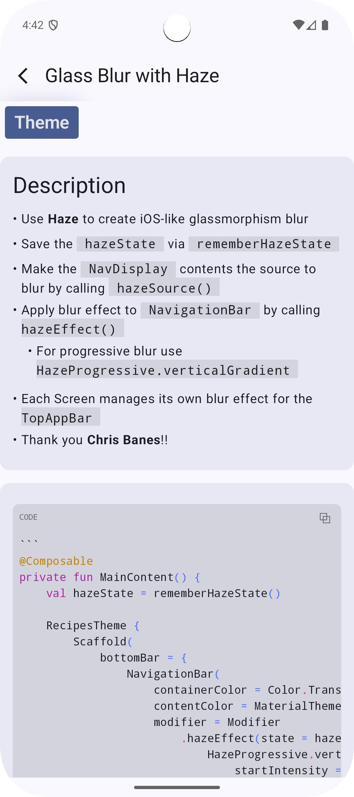 |

https://github.com/user-attachments/assets/cac97b4d-723e-4d29-a6a2-46b2f1368478

### Dependencies
| Dependency                                                                                     | Description                                         | 
|------------------------------------------------------------------------------------------------|-----------------------------------------------------|
| [Coil](https://coil-kt.github.io/coil/)                                                        | Image Loader for Jetpack Compose                    |  
| [Compose Material3](https://developer.android.com/jetpack/androidx/releases/compose-material3) | Material Design Components for Jetpack Compose      | 
| [Compose Navigation3](https://github.com/android/nav3-recipes)                                 | Navigation Component for Jetpack Compose            | 
| [Haze](https://chrisbanes.github.io/haze/latest/)                                              | Chris Banes 'glassmorphism' blur library for Compose. |
| [Hilt](https://developer.android.com/training/dependency-injection/hilt-android)               | Dependency Injection for Android                    | 
| [KmLogging](https://github.com/LighthouseGames/KmLogging)                                      | Kotlin Multiplatform logging library (v2.0.3).      |
| [Ktor](https://ktor.io/)                                                                       | HTTP Client for Android                             | 
| [Markdown Renderer](hhttps://github.com/mikepenz/multiplatform-markdown-renderer)              | Mike Penz Multiplatform Markdown Renderer           |
| [TheMealDB](https://www.themealdb.com/api.php)                                                 | Free, easy to use, API for Food Recipes             |
| [Truth](https://truth.dev/)                                                                    | Google Assertion Library used for Testing           |
| [Turbine](https://github.com/cashapp/turbine)                                                  | Couroutine Flow Testing Library from CashApp        |
