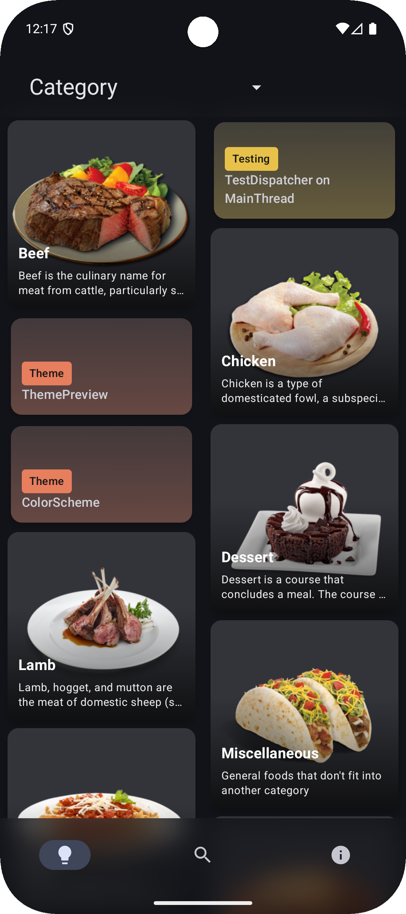
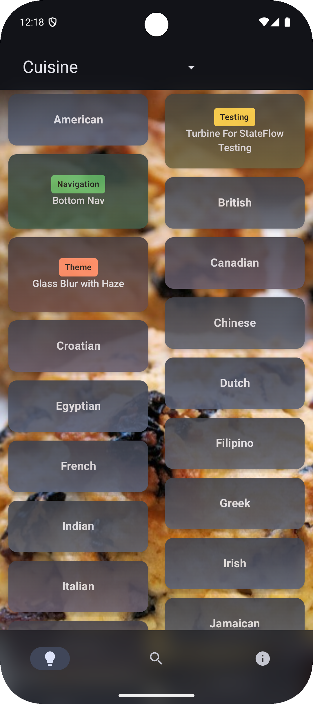
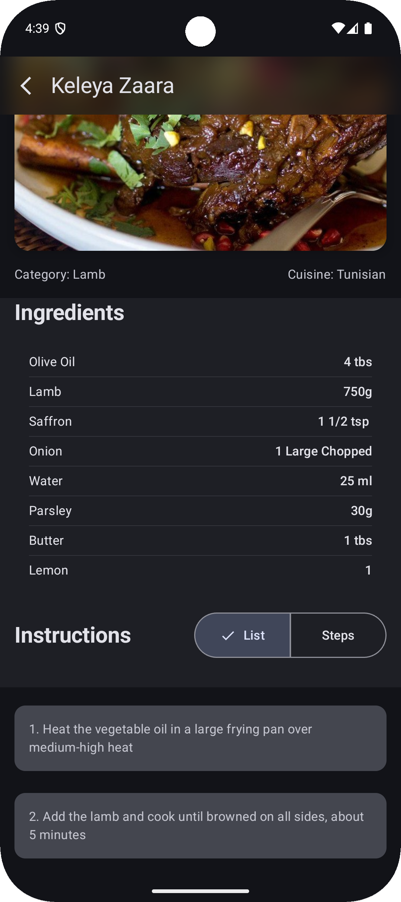
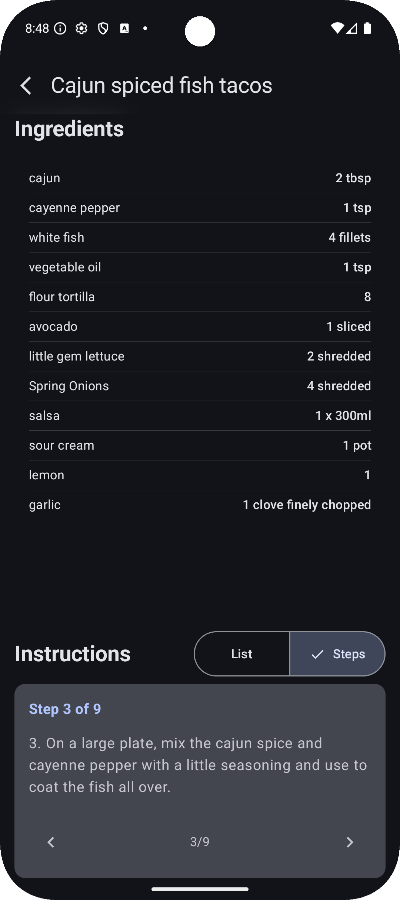
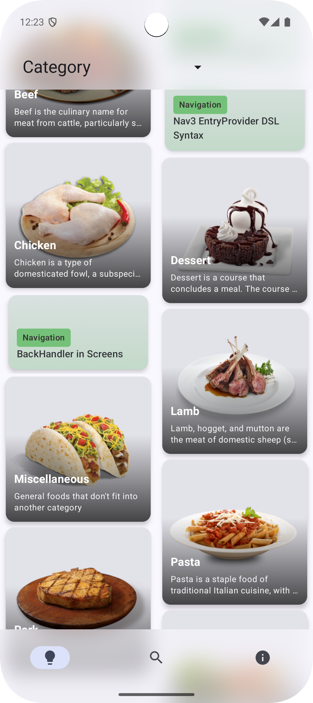
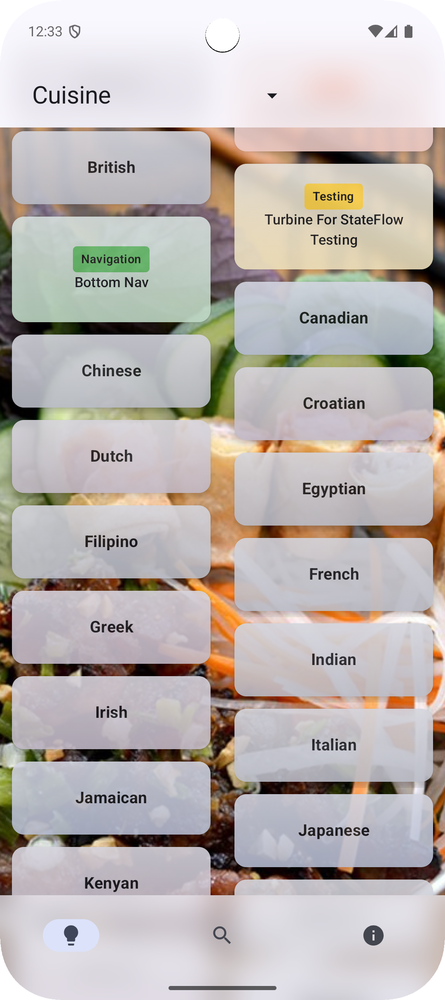
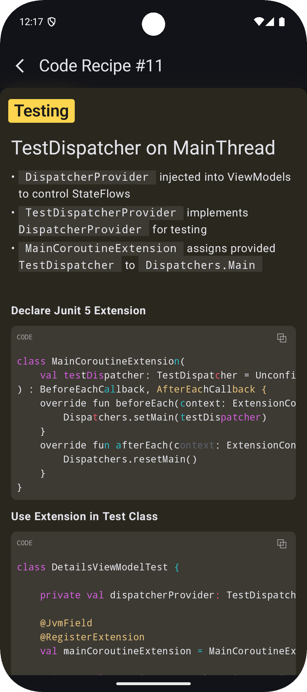
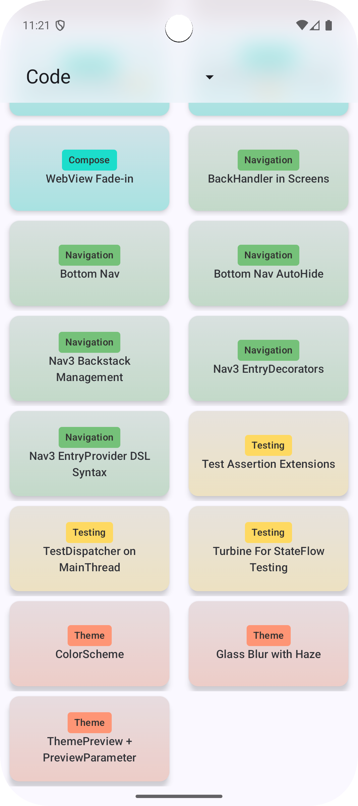
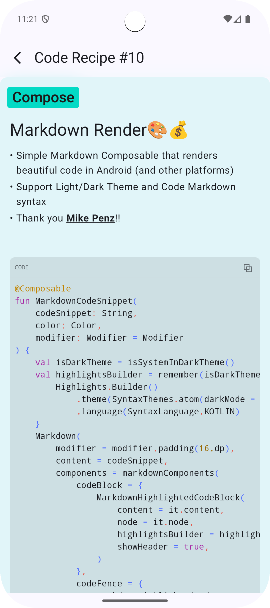

# Recipe Reference App

### WHAT IS THIS?
Keeping up with the latest Android trends is always a challenge. One of the techniques I use is to always have a reference app handy. These apps should showcase the latest Android architecture and patterns for the following areas:
- UI and Biz Logic Separation
- Navigation UX and Theme
- Data and Image Retrieval
- Threading
- Dependency Injection
- Testing

The latest incarnation for my reference app is called ***Recipes***. 

Since I love a good double entendre, this app ***conflates*** _Meal_ and _Code_ **Recipes**, creating a UX to demonstrate the techniques it describes. 

One data source for this app is from the excellent (and free) [TheMealDB](https://www.themealdb.com/) which has nice amount of categorized data with textual and visual information describing a semi-complex process (aka, a ***Meal Recipe***). The other data source was my 🧠 and describes the code used to build the app in the form of ***Code Recipes*** (sprinkled in amongst the ***Meal Recipes***)

***Code Recipes: 👉👉 [assets/code-recipes](https://github.com/balch/Recipes/tree/main/app/src/main/assets/code-recipes) 👈👈***

The goal was to brush up on the the latest **Android** tech stack components and pack as many features as I could into an app created in 3 weekends of watching sports on the couch. **Junie** and **Claude** actually did a lot of work, and once again came through in frontend design and impl, dependency management, and kicking off new features. This time the data model was a huge AI win as I prompted **Junie** with the [TheMealDB API](https://www.themealdb.com/api.php) url, a reference to [Ktor](https://ktor.io/), and in less than 5 minutes the API layer materialized in my _git status_ staged log. 

Another reason this app came together so nicely is due to the plethora of free and easy to use **Android Tools and Libraries** supplied by both _Big-Biz_ (hello _GOOGLE_ and _JETBRAINS_), and the **Android Community ICs** toiling away on GitHub and Medium. The ***Code Recipes*** mostly originate from these sources and describe the wiring and plumbing used to create a visually complelling **Android Application**.

### Demo
|            Dark Mode                                                                                   |           Light Mode                                                                                    |
|:---------------------------------------------------------------------------------------------:|:---------------------------------------------------------------------------------------------:|
| <video src="https://github.com/user-attachments/assets/4723386b-970f-4c90-8d60-919193125c62"> | <video src="https://github.com/user-attachments/assets/82fb3350-ffc5-48bd-8030-16ff4972f4b3"> |

<b>Meal Recipes</b>

|                                      Categories                                      |                                       Cuisine                                       |                                        Detail List                                         |                                        Detail Step By Step                                         |
|:------------------------------------------------------------------------------------:|:-----------------------------------------------------------------------------------:|:------------------------------------------------------------------------------------------:|:--------------------------------------------------------------------------------------------------:|
|    |     |    |    |
|  |  |  |  |

<b>Code Recipes</b>

|                                    Code Recipes                                    |                                        Code Recipe Detail                                         |
|:----------------------------------------------------------------------------------:|:-------------------------------------------------------------------------------------------------:|
|  |    |
|     |  |

<b>Detail Screens</b>

  
|  Dark Mode                                                                                             |   Light Mode                                                                                              | 
|:---------------------------------------------------------------------------------------------:|:---------------------------------------------------------------------------------------------:|
| <video src="https://github.com/user-attachments/assets/36a5b9b5-0a16-4ec8-b9d1-a13194ce5234"> | <video src="https://github.com/user-attachments/assets/4efd0269-0229-47d3-9796-2cfd27a65303"> |

### Dependencies
| Dependency                                                                                     | Description                                           | 
|------------------------------------------------------------------------------------------------|-------------------------------------------------------|
| [Coil](https://coil-kt.github.io/coil/)                                                        | Image Loader for Jetpack Compose                      |  
| [Compose Material3](https://developer.android.com/jetpack/androidx/releases/compose-material3) | Material Design Components for Jetpack Compose        | 
| [Compose Navigation3](https://github.com/android/nav3-recipes)                                 | Navigation Component for Jetpack Compose              | 
| [Haze](https://chrisbanes.github.io/haze/latest/)                                              | Chris Banes 'glassmorphism' blur library for Compose. |
| [Hilt](https://developer.android.com/training/dependency-injection/hilt-android)               | Dependency Injection for Android                      | 
| [KmLogging](https://github.com/LighthouseGames/KmLogging)                                      | Kotlin Multiplatform logging library (v2.0.3).        |
| [Ktor](https://ktor.io/)                                                                       | HTTP Client for Android                               | 
| [Markdown Renderer](https://github.com/mikepenz/multiplatform-markdown-renderer)               | Mike Penz Multiplatform Markdown Renderer             |
| [TheMealDB](https://www.themealdb.com/api.php)                                                 | Free, easy to use, API for Food Recipes               |
| [Truth](https://truth.dev/)                                                                    | Google Assertion Library used for Testing             |
| [Turbine](https://github.com/cashapp/turbine)                                                  | Couroutine Flow Testing Library from CashApp          |
